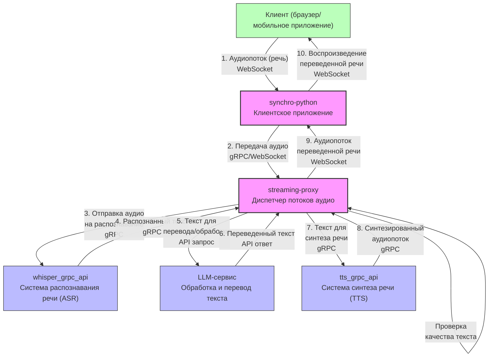

# Архитектура системы синхронного перевода

Данная диаграмма отображает архитектуру и все процессы в проектах системы синхронного перевода.

## Детальное описание процессов

### 1. Процесс передачи и обработки речи:
1. **Клиент** (пользователь) говорит на своем языке через браузер или мобильное приложение
2. **synchro-python** (клиентское приложение) захватывает аудиопоток и отправляет его в диспетчер
3. **streaming-proxy** принимает аудиопоток и перенаправляет его в сервис распознавания речи
4. **whisper_grpc_api** преобразует речь в текст и возвращает результат в streaming-proxy
5. **streaming-proxy** выполняет проверку качества текста
6. Если текст распознан корректно, **streaming-proxy** отправляет его в LLM-сервис для перевода
7. LLM-сервис переводит текст и возвращает результат в **streaming-proxy**
8. **streaming-proxy** отправляет переведенный текст в **tts_grpc_api** для синтеза речи
9. **tts_grpc_api** преобразует переведенный текст в речь и возвращает аудиопоток
10. **streaming-proxy** передает синтезированную речь обратно в **synchro-python**
11. **synchro-python** воспроизводит переведенную речь для пользователя

### 2. Обработка ошибок и нестандартных ситуаций:
- Если **whisper_grpc_api** не может распознать речь, **streaming-proxy** может запросить повторную передачу
- Если LLM-сервис не доступен, **streaming-proxy** может использовать альтернативные методы перевода
- При проблемах с качеством синтезированной речи, **streaming-proxy** может запросить повторный синтез

## Технические детали:
- **synchro-python**: клиентское Python-приложение для взаимодействия с пользователем
- **streaming-proxy**: центральный компонент системы, координирующий все процессы
- **whisper_grpc_api**: gRPC сервис для распознавания речи на базе модели Whisper
- **tts_grpc_api**: gRPC сервис для синтеза речи
- Все компоненты взаимодействуют через gRPC и WebSocket протоколы для минимизации задержек
