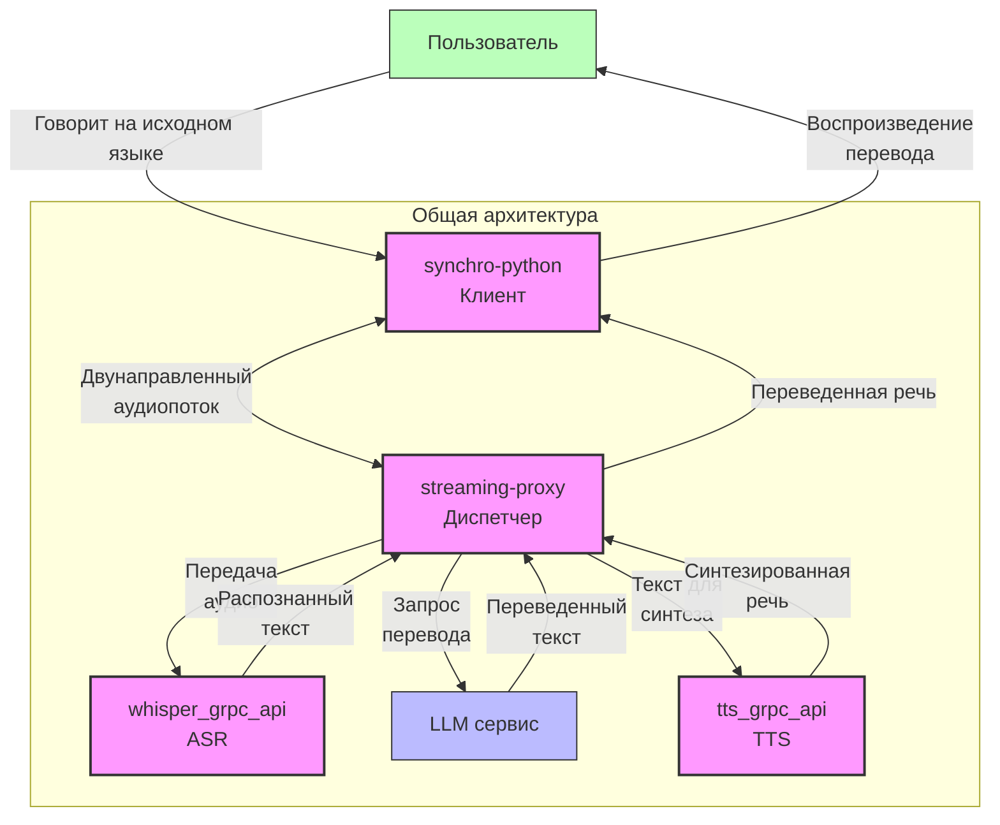
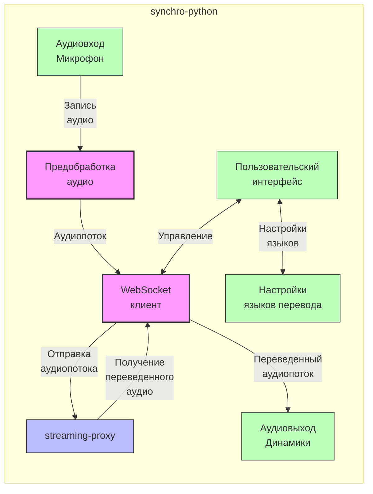
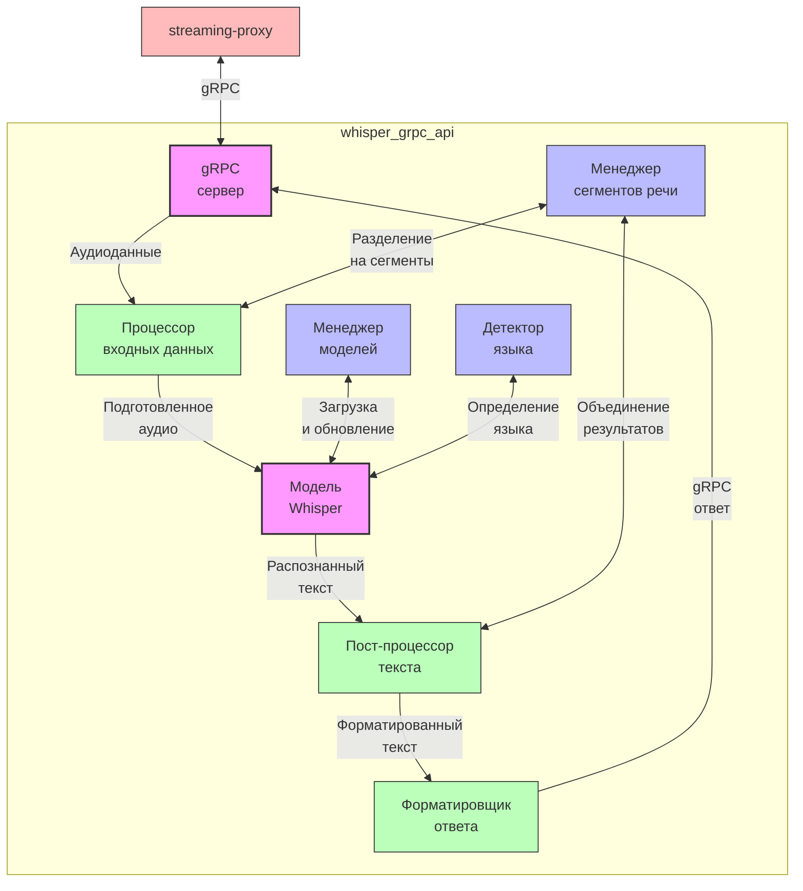
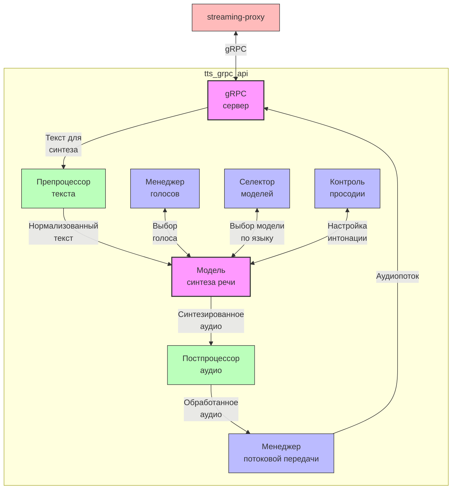
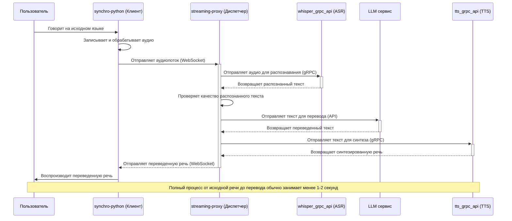
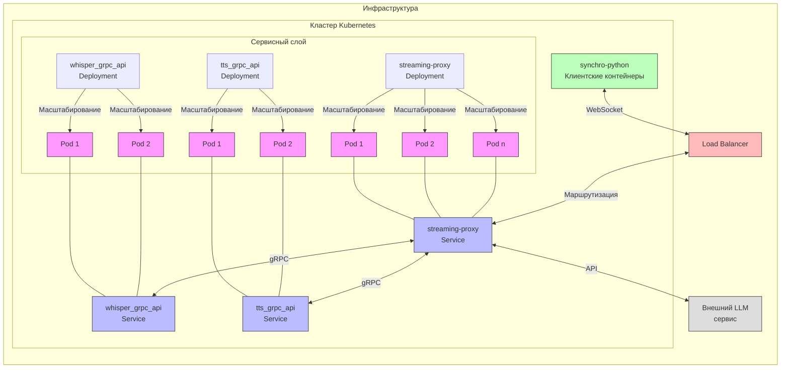

# Документация системы синхронного перевода

В этом документе представлены детальные схемы и описания работы четырех ключевых сервисов системы синхронного перевода речи.

## Содержание
1. [Общая архитектура](#общая-архитектура)
2. [synchro-python (Клиент)](#synchro-python-клиент)
3. [streaming-proxy (Диспетчер)](#streaming-proxy-диспетчер)
4. [whisper_grpc_api (Распознавание речи)](#whisper_grpc_api-распознавание-речи)
5. [tts_grpc_api (Синтез речи)](#tts_grpc_api-синтез-речи)

## Общая архитектура

Система синхронного перевода состоит из четырех основных компонентов, взаимодействующих для обеспечения потокового перевода речи в реальном времени.



## synchro-python (Клиент)

synchro-python - это клиентское приложение, которое взаимодействует с пользователем, обрабатывает аудиовход и аудиовыход.



### Основные процессы в synchro-python:

1. **Захват аудио**:
   - Получение аудиопотока с микрофона пользователя
   - Обработка аудио (нормализация, подавление шума)
   - Разделение аудио на фрагменты для передачи

2. **Передача аудио**:
   - Установление и поддержание WebSocket соединения с streaming-proxy
   - Потоковая передача аудиофрагментов
   - Обработка сетевых ошибок и повторные подключения

3. **Получение переведенного аудио**:
   - Прием аудиопотока с переведенной речью
   - Буферизация для плавного воспроизведения
   - Контроль задержки и синхронизации

4. **Пользовательский интерфейс**:
   - Выбор исходного и целевого языков
   - Управление режимами перевода (последовательный/синхронный)
   - Индикация процессов и состояния системы

### Технические детали:

- **Язык программирования**: Python
- **Протоколы связи**: WebSocket для аудиопотоков
- **Формат аудио**: 16-битный PCM, 16 кГц, моно
- **Аудиобиблиотеки**: PyAudio для захвата и воспроизведения аудио
- **Сетевые библиотеки**: websocket-client или aiohttp

## streaming-proxy (Диспетчер)

streaming-proxy - центральный компонент системы, который координирует процесс перевода, маршрутизирует потоки данных между различными сервисами и обрабатывает аудио- и текстовые потоки.

```mermaid
flowchart TB
    subgraph streaming-proxy
        direction TB
        
        WebSocketServer[WebSocket<br>сервер] -->|Входящий<br>аудиопоток| AudioQueue[Очередь<br>аудиопакетов]
        
        AudioQueue -->|Блоки<br>аудио| ASRClient[Клиент ASR<br>(gRPC)]
        ASRClient -->|Запрос<br>распознавания| WhisperAPI[whisper_grpc_api]
        WhisperAPI -->|Распознанный<br>текст| TextProcessor[Обработчик<br>текста]
        
        TextProcessor -->|Текст для<br>перевода| TranslationClient[Клиент<br>перевода]
        TranslationClient -->|API<br>запрос| LLM[LLM сервис]
        LLM -->|Переведенный<br>текст| TTSClient[Клиент TTS<br>(gRPC)]
        
        TTSClient -->|Запрос<br>синтеза| TTS[tts_grpc_api]
        TTS -->|Синтезированная<br>речь| AudioResponseQueue[Очередь исходящих<br>аудиопакетов]
        
        AudioResponseQueue -->|Переведенный<br>аудиопоток| WebSocketServer
        
        SessionManager[Менеджер<br>сессий] <-->|Управление<br>состоянием| WebSocketServer
        SessionManager <-->|Контроль<br>процессов| AudioQueue
        SessionManager <-->|Контроль<br>процессов| TextProcessor
        
        ErrorHandler[Обработчик<br>ошибок] <-->|Мониторинг| SessionManager
        ErrorHandler <-->|Обработка<br>ошибок| ASRClient
        ErrorHandler <-->|Обработка<br>ошибок| TranslationClient
        ErrorHandler <-->|Обработка<br>ошибок| TTSClient
    end
    
    SynchroClient[synchro-python] <-->|WebSocket| WebSocketServer
    
    classDef core fill:#f9f,stroke:#333,stroke-width:2px;
    classDef queue fill:#bfb,stroke:#333,stroke-width:1px;
    classDef client fill:#bbf,stroke:#333,stroke-width:1px;
    classDef external fill:#fbb,stroke:#333,stroke-width:1px;
    classDef manager fill:#ddd,stroke:#333,stroke-width:1px;
    
    class WebSocketServer,TextProcessor,SessionManager core;
    class AudioQueue,AudioResponseQueue queue;
    class ASRClient,TranslationClient,TTSClient client;
    class WhisperAPI,LLM,TTS,SynchroClient external;
    class ErrorHandler manager;
```

### Основные процессы в streaming-proxy:

1. **Управление соединениями**:
   - Прием входящих WebSocket соединений от клиентов
   - Аутентификация и авторизация клиентов
   - Управление сессиями перевода

2. **Обработка аудиопотока**:
   - Буферизация входящего аудио
   - Формирование пакетов для ASR
   - Определение границ речевых сегментов

3. **Взаимодействие с whisper_grpc_api (ASR)**:
   - Отправка аудиопакетов в сервис распознавания
   - Получение распознанного текста
   - Обработка ошибок распознавания

4. **Взаимодействие с LLM-сервисом**:
   - Передача распознанного текста для перевода
   - Получение переведенного текста
   - Обработка контекста для более точного перевода

5. **Взаимодействие с tts_grpc_api**:
   - Отправка переведенного текста для синтеза речи
   - Получение синтезированного аудио
   - Управление параметрами синтеза (голос, темп)

6. **Возврат аудиопотока клиенту**:
   - Формирование потока с переведенной речью
   - Отправка через WebSocket клиенту
   - Управление качеством сервиса (QoS)

### Технические детали:

- **Язык программирования**: Python/Node.js
- **Протоколы связи**: 
  - WebSocket для взаимодействия с клиентами
  - gRPC для взаимодействия с сервисами ASR и TTS
  - REST API для взаимодействия с LLM
- **Асинхронное программирование**: asyncio или event-driven архитектура
- **Мониторинг и логирование**: Prometheus, ELK stack или другие системы

## whisper_grpc_api (Распознавание речи)

whisper_grpc_api - сервис автоматического распознавания речи (ASR), основанный на модели Whisper, предоставляющий gRPC API для преобразования аудио в текст.



### Основные процессы в whisper_grpc_api:

1. **Прием аудиоданных**:
   - Получение аудиофрагментов через gRPC
   - Валидация входных данных
   - Преобразование в формат, необходимый для модели

2. **Предобработка аудио**:
   - Конвертация форматов (при необходимости)
   - Сегментация аудио на части
   - Нормализация и фильтрация шума (если требуется)

3. **Распознавание речи**:
   - Загрузка соответствующей языковой модели
   - Выполнение инференса модели Whisper
   - Обработка вероятностей и предсказаний

4. **Постобработка текста**:
   - Пунктуация и форматирование
   - Фильтрация заполнителей ("эм", "хм" и т.д.)
   - Объединение фрагментов в полные предложения

5. **Возврат результатов**:
   - Формирование gRPC ответа
   - Отправка распознанного текста
   - Включение метаданных (уверенность, альтернативы)

### Технические детали:

- **Модель**: OpenAI Whisper или ее варианты (small, medium, large)
- **Языки программирования**: Python с PyTorch/TensorFlow
- **gRPC и Protocol Buffers** для определения API
- **CUDA/GPU** для ускорения инференса
- **Опционально**: интеграция с системами кэширования для часто встречающихся фраз

## tts_grpc_api (Синтез речи)

tts_grpc_api - сервис синтеза речи (TTS), преобразующий текст в естественно звучащую речь с поддержкой множества языков и голосов.



### Основные процессы в tts_grpc_api:

1. **Прием текста для синтеза**:
   - Получение текста через gRPC
   - Парсинг дополнительных параметров (голос, скорость)
   - Валидация входных данных

2. **Предобработка текста**:
   - Нормализация (числа, даты, аббревиатуры)
   - Анализ синтаксической структуры
   - Разделение на фрагменты для синтеза

3. **Синтез речи**:
   - Выбор подходящей модели и голоса
   - Выполнение инференса нейросетевой модели
   - Генерация аудио с нужными характеристиками

4. **Постобработка аудио**:
   - Нормализация громкости
   - Фильтрация артефактов
   - Сглаживание переходов между фрагментами

5. **Потоковая передача**:
   - Формирование аудиопотока
   - Отправка через gRPC
   - Управление буферизацией

### Технические детали:

- **Модели TTS**: FastSpeech, Tacotron, WaveNet или аналогичные
- **Язык программирования**: Python с PyTorch/TensorFlow
- **Audio Processing**: librosa, soundfile
- **gRPC** для API
- **Голосовая библиотека**: набор предобученных голосовых моделей для разных языков

## Взаимодействие компонентов и жизненный цикл запроса



## Конфигурация и развертывание

Все компоненты системы могут быть развернуты как в отдельных контейнерах Docker, так и на физических/виртуальных машинах. Для обеспечения масштабируемости и отказоустойчивости рекомендуется использовать оркестрацию контейнеров (например, Kubernetes).

### Пример конфигурации контейнеров:



## Заключение

Система синхронного перевода представляет собой сложное распределенное приложение, состоящее из четырех основных компонентов:

1. **synchro-python** - клиентское приложение, обеспечивающее взаимодействие с пользователем
2. **streaming-proxy** - центральный компонент, координирующий все процессы перевода
3. **whisper_grpc_api** - сервис распознавания речи, преобразующий аудио в текст
4. **tts_grpc_api** - сервис синтеза речи, преобразующий переведенный текст в речь

Взаимодействие этих компонентов позволяет реализовать синхронный перевод речи с минимальной задержкой, что может быть применено в различных областях: от международных конференций и деловых переговоров до образовательных программ и туристических приложений.

Масштабируемая архитектура системы обеспечивает возможность обслуживания большого числа пользователей одновременно, а модульная структура позволяет легко обновлять отдельные компоненты без необходимости изменения всей системы.
