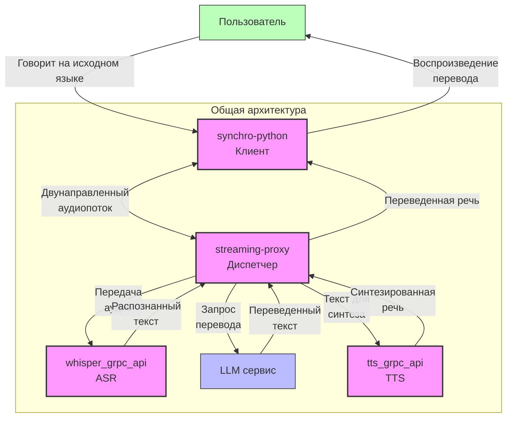
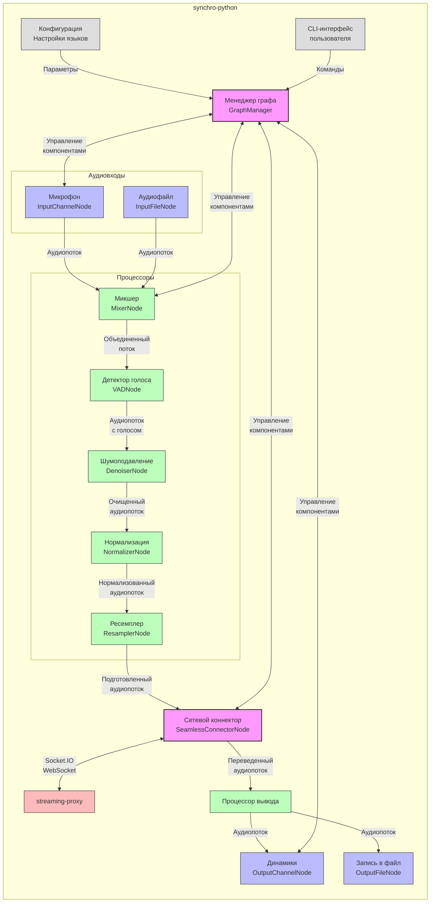
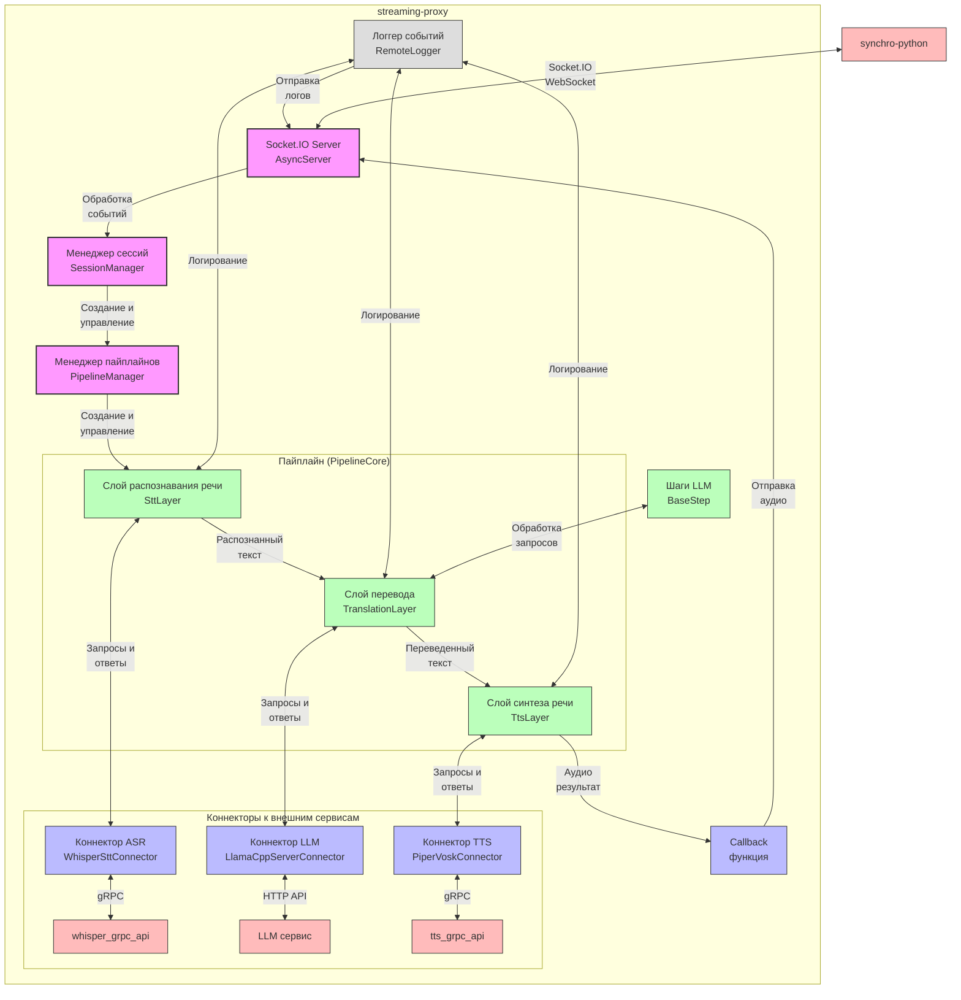
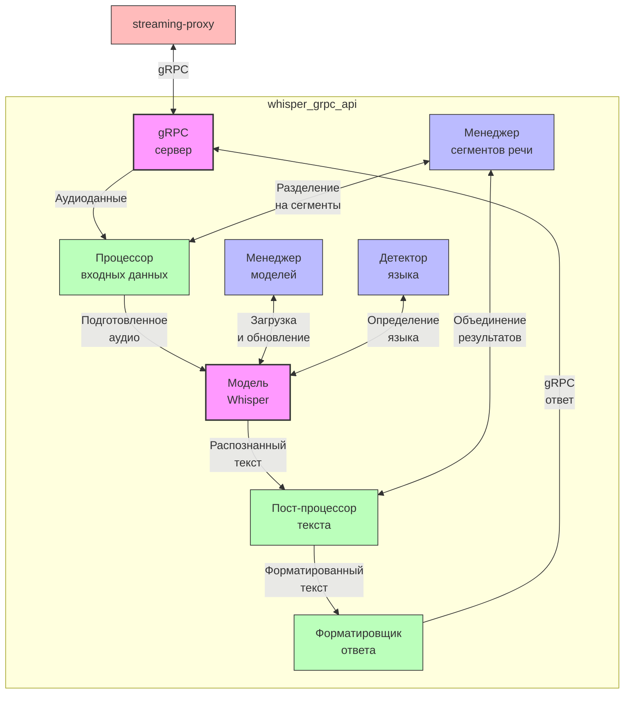
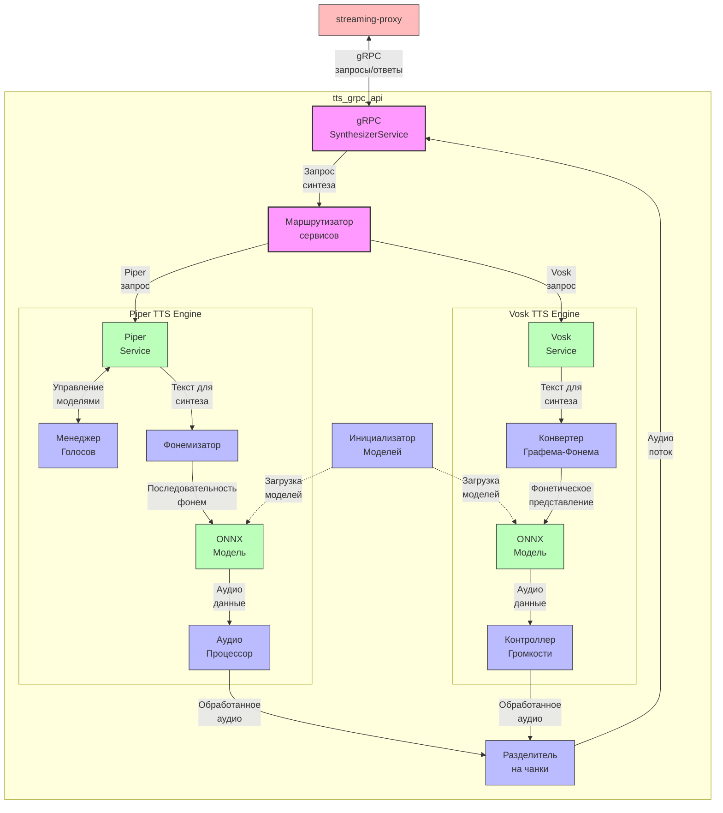
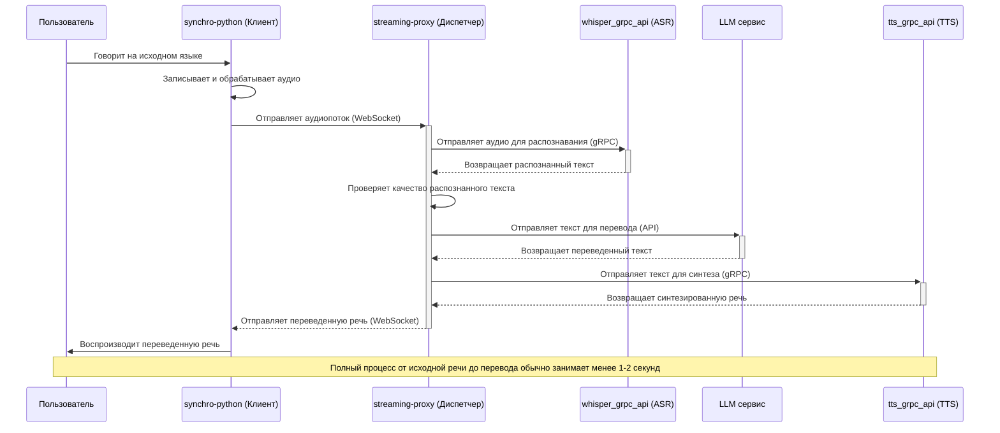
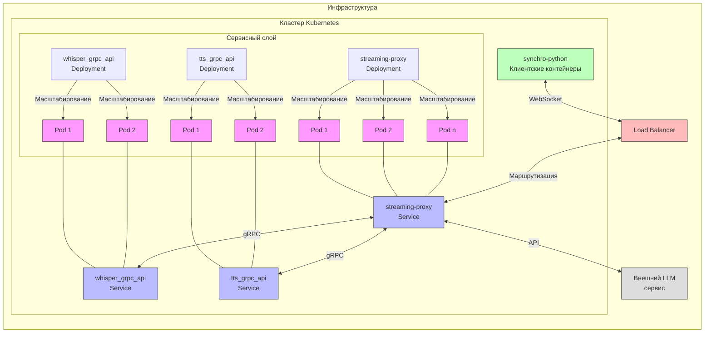

# Документация системы синхронного перевода

В этом документе представлены детальные схемы и описания работы четырех ключевых сервисов системы синхронного перевода речи.

## Содержание
1. [Общая архитектура](#общая-архитектура)
2. [synchro-python (Клиент)](#synchro-python-клиент)
3. [streaming-proxy (Диспетчер)](#streaming-proxy-диспетчер)
4. [whisper_grpc_api (Распознавание речи)](#whisper_grpc_api-распознавание-речи)
5. [tts_grpc_api (Синтез речи)](#tts_grpc_api-синтез-речи)

## Общая архитектура

Система синхронного перевода состоит из четырех основных компонентов, взаимодействующих для обеспечения потокового перевода речи в реальном времени.

## synchro-python (Клиент)

synchro-python - это клиентское приложение, которое взаимодействует с пользователем, обрабатывает аудиовход и аудиовыход.

### Основные процессы в synchro-python:

1. **Захват аудио**:
   - Получение аудиопотока с микрофона пользователя
   - Обработка аудио (нормализация, подавление шума)
   - Разделение аудио на фрагменты для передачи

2. **Передача аудио**:
   - Установление и поддержание WebSocket соединения с streaming-proxy
   - Потоковая передача аудиофрагментов
   - Обработка сетевых ошибок и повторные подключения

3. **Получение переведенного аудио**:
   - Прием аудиопотока с переведенной речью
   - Буферизация для плавного воспроизведения
   - Контроль задержки и синхронизации

4. **Пользовательский интерфейс**:
   - Выбор исходного и целевого языков
   - Управление режимами перевода (последовательный/синхронный)
   - Индикация процессов и состояния системы

### Технические детали:

- **Язык программирования**: Python
- **Архитектура**: Графовая система с узлами и рёбрами для обработки аудиопотоков
- **Протоколы связи**: Socket.IO через WebSocket для аудиопотоков
- **Формат аудио**: 16-битный PCM, частота дискретизации от 16 кГц до 48 кГц, моно
- **Конфигурация**: Hydra для управления конфигурацией и параметрами
- **Клиентские библиотеки**: PyAudio для захвата и воспроизведения аудио, SimpleClient для Socket.IO
- **Обработка аудио**: Модули VAD (Voice Activity Detection), шумоподавление, нормализация, ресемплинг
- **Форматы ввода/вывода**: Микрофон, аудиофайлы, динамики, запись в файл
- **Менеджер графа**: Управление жизненным циклом узлов обработки, координация потоков данных

## streaming-proxy (Диспетчер)

streaming-proxy - центральный компонент системы, который координирует процесс перевода, маршрутизирует потоки данных между различными сервисами и обрабатывает аудио- и текстовые потоки.

### Основные процессы в streaming-proxy:

1. **Управление сессиями и соединениями**:
   - Прием входящих Socket.IO соединений от клиентов
   - Настройка потоков перевода с выбором языков источника и назначения
   - Создание и управление пайплайнами обработки для каждой сессии
   - Обработка событий подключения/отключения клиентов

2. **Организация пайплайна обработки**:
   - Создание трехслойной архитектуры (распознавание, перевод, синтез)
   - Асинхронная обработка потоков данных между слоями
   - Параллельное выполнение циклов обработки для каждого слоя
   - Управление жизненным циклом пайплайнов

3. **Распознавание речи (SttLayer)**:
   - Отправка аудиоданных через gRPC в Whisper API
   - Потоковое получение распознанного текста
   - Фильтрация стоп-слов и буферизация результатов
   - Сегментация текста для обработки

4. **Перевод текста (TranslationLayer)**:
   - Пошаговая обработка текста через различные этапы LLM
   - Гейтинг контента для фильтрации ненужных фрагментов
   - Формирование запросов к LLM API с использованием шаблонов
   - Обработка ответов и поддержание контекста перевода

5. **Синтез речи (TtsLayer)**:
   - Отправка переведенного текста в TTS сервис через gRPC
   - Получение фрагментов синтезированной речи
   - Добавление интервалов тишины между фрагментами
   - Передача аудиорезультатов обратно клиенту

6. **Логирование и аналитика**:
   - Сбор и отправка метрик и логов клиенту
   - Измерение времени выполнения операций
   - Отслеживание производительности каждого этапа обработки
   - Структурированное логирование событий с контекстом

7. **Возврат аудиопотока клиенту**:
   - Формирование потока с переведенной речью
   - Отправка через Socket.IO клиенту
   - Управление качеством и параметрами синтеза (голос, темп)

### Технические детали:

- **Язык программирования**: Python
- **Серверный фреймворк**: Socket.IO AsyncServer с ASGI-совместимостью
- **Асинхронная обработка**: asyncio для параллельного выполнения слоев пайплайна
- **Коннекторы внешних сервисов**:
  - WhisperSttConnector: gRPC клиент для сервиса распознавания речи
  - LlamaCppServerConnector: HTTP клиент для LLM сервиса
  - PiperVoskConnector: gRPC клиент для сервиса синтеза речи
- **Буферизация**: TimeoutTextBuffer для обработки и сегментации текста
- **Протоколы связи**: gRPC для ASR и TTS, HTTP для LLM
- **Модульная архитектура**: трехслойная структура с разделением ответственности
- **Логирование**: RemoteLogger для отправки событий клиенту
- **Шаги обработки LLM**: Настраиваемые шаги обработки (гейтинг, перевод, коррекция)
- **Управление конфигурацией**: Pydantic-схемы для валидации настроек

## whisper_grpc_api (Распознавание речи)

whisper_grpc_api - сервис автоматического распознавания речи (ASR), основанный на модели Whisper, предоставляющий gRPC API для преобразования аудио в текст.

### Основные процессы в whisper_grpc_api:

1. **Прием аудиоданных**:
   - Получение аудиофрагментов через gRPC
   - Валидация входных данных
   - Преобразование в формат, необходимый для модели

2. **Предобработка аудио**:
   - Конвертация форматов (при необходимости)
   - Сегментация аудио на части
   - Нормализация и фильтрация шума (если требуется)

3. **Распознавание речи**:
   - Загрузка соответствующей языковой модели
   - Выполнение инференса модели Whisper
   - Обработка вероятностей и предсказаний

4. **Постобработка текста**:
   - Пунктуация и форматирование
   - Фильтрация заполнителей ("эм", "хм" и т.д.)
   - Объединение фрагментов в полные предложения

5. **Возврат результатов**:
   - Формирование gRPC ответа
   - Отправка распознанного текста
   - Включение метаданных (уверенность, альтернативы)

### Технические детали:

- **Модель**: OpenAI Whisper или ее варианты (small, medium, large)
- **Языки программирования**: Python с PyTorch/TensorFlow
- **gRPC и Protocol Buffers** для определения API
- **CUDA/GPU** для ускорения инференса
- **Опционально**: интеграция с системами кэширования для часто встречающихся фраз

## tts_grpc_api (Синтез речи)

tts_grpc_api - сервис синтеза речи (TTS), преобразующий текст в естественно звучащую речь с поддержкой множества языков и голосов, основанный на двух ключевых системах: Piper и Vosk TTS.

### Основные процессы в tts_grpc_api:

1. **Маршрутизация запросов синтеза речи**:
   - Получение текста и параметров синтеза через gRPC API
   - Определение запрашиваемого TTS сервиса (Piper или Vosk)
   - Перенаправление запроса соответствующему обработчику

2. **Работа с Piper TTS**:
   - Загрузка соответствующей модели для запрошенного голоса
   - Фонемизация текста с использованием espeak или графемно-фонемных конвертеров
   - Преобразование фонем в идентификаторы для модели
   - Синтез речи с использованием ONNX моделей
   - Потоковая обработка и возврат аудио

3. **Работа с Vosk TTS**:
   - Загрузка модели для нужного языка
   - Графемно-фонемное преобразование текста
   - Синтез речи с применением ONNX модели
   - Настройка параметров синтеза (скорость речи, выбор дикторов)
   - Обработка громкости аудио

4. **Управление моделями**:
   - Инициализация и загрузка ONNX моделей в память
   - Кэширование моделей для повторного использования
   - Управление несколькими голосами для разных языков
   - Выбор подходящего провайдера выполнения (CPU/CUDA)

5. **Потоковая передача**:
   - Разделение синтезированного аудио на чанки
   - Потоковая отправка аудио через gRPC
   - Управление двунаправленным потоковым синтезом для интерактивного взаимодействия

### Технические детали:

- **Модели синтеза**: 
  - **Piper**: ONNX модели на основе VITS (Variational Inference with adversarial learning for end-to-end TTS)
  - **Vosk TTS**: Модели, основанные на нейросетевых архитектурах для синтеза речи
- **Языки программирования**: Python с ONNX Runtime для инференса
- **Фонемизация**: Библиотеки piper_phonemize и espeak для преобразования текста в фонемы
- **Обработка аудио**: Управление громкостью, нормализация и потоковая передача
- **gRPC API**: Унифицированный интерфейс для различных TTS бэкендов
- **Инференс моделей**: Поддержка как CPU, так и GPU (CUDA) для оптимизации производительности

## Взаимодействие компонентов и жизненный цикл запроса

## Конфигурация и развертывание

Все компоненты системы могут быть развернуты как в отдельных контейнерах Docker, так и на физических/виртуальных машинах. Для обеспечения масштабируемости и отказоустойчивости рекомендуется использовать оркестрацию контейнеров (например, Kubernetes).

### Пример конфигурации контейнеров:

## Заключение

Система синхронного перевода представляет собой сложное распределенное приложение, состоящее из четырех основных компонентов:

1. **synchro-python** - клиентское приложение, обеспечивающее взаимодействие с пользователем
2. **streaming-proxy** - центральный компонент, координирующий все процессы перевода
3. **whisper_grpc_api** - сервис распознавания речи, преобразующий аудио в текст
4. **tts_grpc_api** - сервис синтеза речи, преобразующий переведенный текст в речь

Взаимодействие этих компонентов позволяет реализовать синхронный перевод речи с минимальной задержкой, что может быть применено в различных областях: от международных конференций и деловых переговоров до образовательных программ и туристических приложений.

Масштабируемая архитектура системы обеспечивает возможность обслуживания большого числа пользователей одновременно, а модульная структура позволяет легко обновлять отдельные компоненты без необходимости изменения всей системы.
